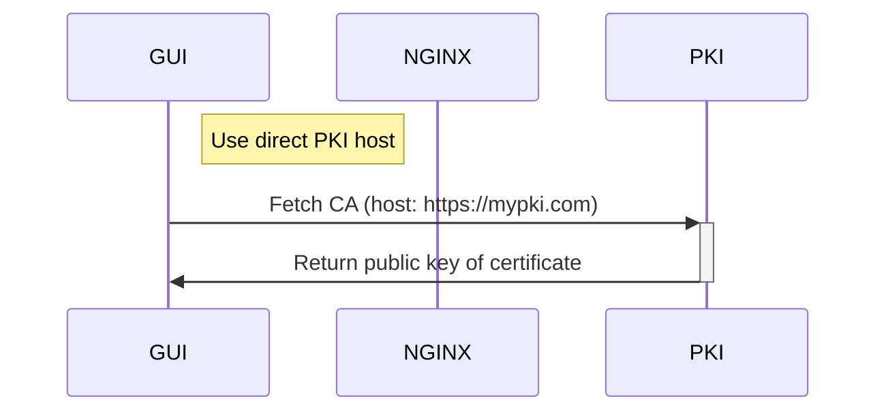
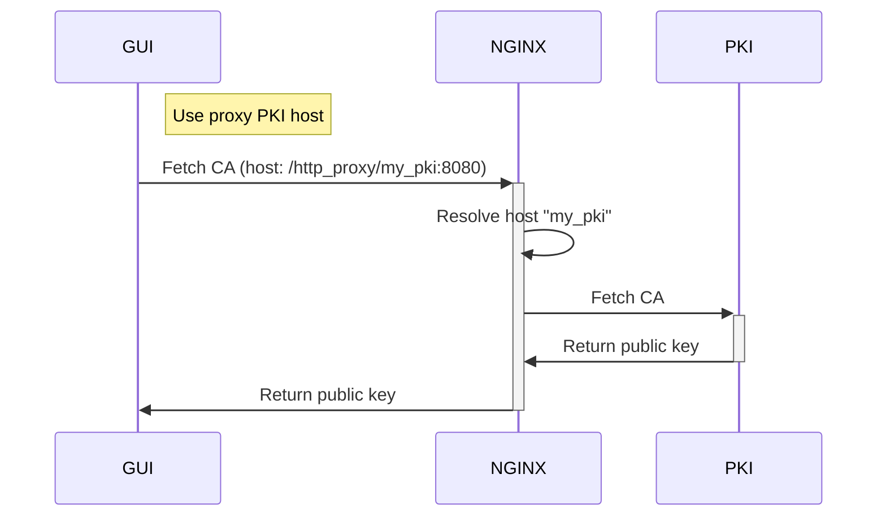

# WirePact Contract Repository

This repository represents the WirePact contract repository to manage trust contracts
for the WirePact distributed authentication system. The contract repository is composed
by two applications: API and GUI. The [API](./api) is a gRPC API that allows CRUD operations on
contracts and a utility method to fetch all public certificates for a certain participant.
This information is considered "public" since there are only public keys of the involved
PKIs. The API however should not be publicly accessible since it would enable anyone with
a gRPC cli to delete your contracts.

The [GUI](./gui) is a single page application based on ["Lit"](https://lit.dev/) that allows
simple management of the contracts via the gRPC API. The GUI is a static site build
that is served by NGINX. One is adviced to protect the GUI application with some
sort of authentication (basic auth or OAuth2.0) to prevent unauthorized access.

## [API](./api)

The API is a rust gRPC application that serves as contract backend. It contains two
storage adapters (for now): "local" and "Kubernetes". Local means, that the contracts
are serialized to the local filesystem under the `./data` directory. "Kubernetes" configures
the API in such a way that Kubernetes Secrets (`V1Secret`) are used to store the contracts.
Be aware that the API needs access to create, modify, and delete Kubernetes Secrets if
deployed with the Kubernetes storage adapter.

To view the possible API calls, see ["contracts.proto"](./api/proto/contracts.proto)
for more information.

As mentioned, the API should not be publicly accessible. If you don't deploy the provided
GUI, you may also use Kubernetes port forwardings to locally access the API and manage
the contracts.

### Configuration

The API can be configured via environment variables or command line arguments.

- `PORT` (`-p | --port <PORT>`): The port on which the API listens for connections (defaults to `8080`)
- `STORAGE` (`-s | --storage <STORAGE>`): The storage adapter to use (defaults to `local`)
- `DEBUG` (`-d | --debug`): Enables debug logging (defaults to `false`)

## [Management GUI](./gui)

The GUI application provides simple access to the API. It is a statically built single
page application based on the "Lit" framework. The GUI is served by NGINX.
To prevent unauthorized access, the GUI should be deployed with some authentication
mechanism (basic auth, OAuth2.0, or some other means of authentication).

The basic function to create a contract requires two or more participants to be added
to the contract. Each participant has a name and a certificate public key. The public key
can either be entered manually or via the [PKI API](https://github.com/WirePact/k8s-pki).

If the automatic way is used, you must provide either the direct hostname on which the
PKI will respond (if openly awailable), or the proxied host. When you are using the proxy
method, you can either choose to use the `http_proxy` or the `https_proxy` route to access
the PKI.

Please consider the following diagrams to understand the access to the PKI.

With the proxy variant, it is possible to access non public PKIs. This could be the case
when the system is deployed within one Kubernetes cluster and the GUI should access
the PKI within the same cluster.

### Configuration

The GUI can be configured with several environment variables. Two are required, while
one is optional and allows proxying the PKI requests.

- `PORT`: The port on which NGINX listens for connections (defaults to `80`)
- `REPO_HOST`: The hostname of the contract API (above)
- `DNS_SERVER`: If configured, allows access via the `http_proxy` (or `https_proxy`) route
  to PKIs that are not publicly accessible
